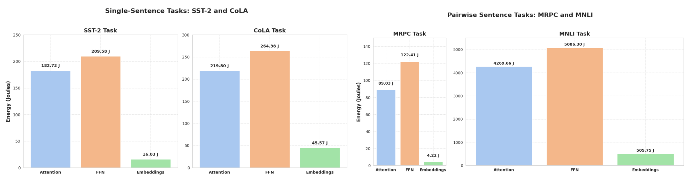
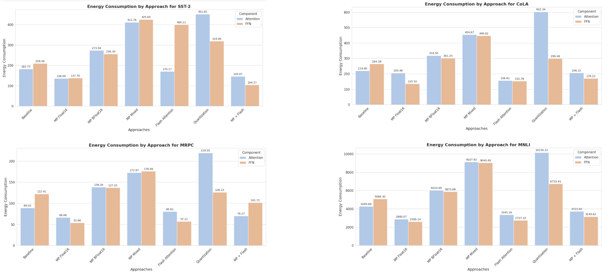
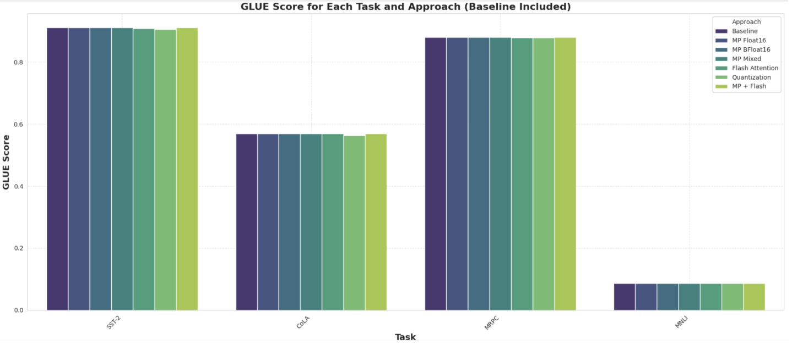
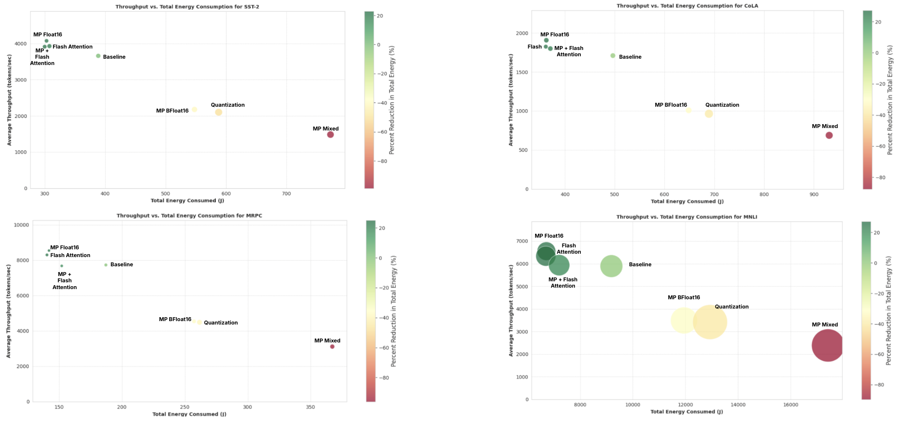

1. Project Title: Optimizing DistilBERT inference for Energy Efficiency
2. Team Members:
a. Rakene Chowdhury (rc3574)
b. Jishan Desai (jd3895)
3. Description:
The exponential growth of artificial intelligence (AI) technologies has led to an increasing reliance on transformer-based models like DistilBERT, resulting in significant computational and energy demands. This study investigates energy efficiency during inference, a critical yet underexplored phase of AI model deployment. Through the application of three optimization techniques—Post-Training Quantization (PTQ), Mixed Precision Inference, and Flash Attention—the research demonstrates the potential to reduce energy consumption while maintaining competitive performance metrics. Using the General Language Understanding Evaluation (GLUE) benchmark datasets, the study evaluates the trade-offs between energy efficiency and task-specific accuracy. Key findings reveal that Mixed Precision Inference and Flash Attention achieve substantial energy reductions without degrading performance, while PTQ can have adverse effects on energy consumption. Profiling tool, ZeusML, was employed to quantify energy usage and emissions, providing actionable insights into sustainable AI practices. These results emphasize the importance of model-level optimizations in complementing infrastructure-based strategies for achieving scalable, energy-efficient AI systems.
4. Code Repository:
All of our code to run the experiments is in Energy_EfficientBERT_Inference.ipynb.  You only need to run this notebook to reproduce our results. All the other files are graphs for this README.
5. How to Run:
Run each cell in Energy_EfficientBERT_Inference.ipynb from top to bottom sequentially. This will run all experiments and produce graphs from our paper.
6. Results:

The results from applying various optimization techniques reveal distinct patterns in energy consumption and task per- formance, driven by differences in implementation efficiency and their impact on specific layers. Key observations and explanations are summarized as follows:
Quantization: Consistent Energy Increases. Despite its theoretical advantages in reducing computation and memory usage, quantization consistently resulted in higher energy consumption across tasks. This behavior is likely due to inefficiencies in the library’s implementation, which intro- duces significant computational overhead for quantizing and dequantizing weights during execution. To rule out framework- specific inefficiencies, alternative libraries were tested, but the results remained consistent. This suggests that the additional energy required for quantization is inherent to the process, particularly for tasks with high attention demands, such as MNLI and CoLA.
Flash Attention: Superior Performance through Opti- mized Implementation. Flash Attention achieved significant energy reductions due to its highly efficient implementation, which leverages tiling strategies and optimized kernel execu- tion. By focusing on memory and computation efficiency inattention mechanisms, Flash Attention provided consistent im- provements, especially for pairwise-sentence tasks like MRPC and MNLI. Furthermore, the Hugging Face implementation of Flash Attention required processing in float16 or bfloat16 formats. This not only optimized attention mechanisms but also indirectly reduced energy consumption in feed-forward networks (FFNs), leading to substantial total energy reductions across tasks.
Mixed Precision (Autocast): Limited Benefits. Mixed Precision (autocast) showed limited energy savings compared to Float16. This is likely due to the frequent fallback to float32 precision for several operations, which diminishes its overall efficiency. Tasks like CoLA and MNLI, which demand higher computational precision, were particularly affected, as maintaining float32 precision negated the potential energy reductions of mixed precision. Infact it did worse on even sst-2.
Mixed Precision (Float16) + Flash Attention: Combined Benefits. The combination of Mixed Precision (Float16) and Flash Attention resulted in additive improvements, merging the energy-saving advantages of Flash Attention with the reduced computational requirements of float16. This synergy effectively optimized both attention layers and FFNs, leading to consistent energy reductions across all tasks, including computationally intensive pairwise tasks such as MNLI. This approach demonstrated its robustness in achieving energy efficiency while maintaining task performance.
These observations underscore the importance of implemen- tation efficiency in optimization techniques. Flash Attention and Mixed Precision (Float16) emerged as the most effective approaches due to their robust implementations and impact on both attention and FFN layers. Conversely, quantization’s in- efficiencies highlight the need for more targeted improvements in library implementations to unlock its potential benefits.

